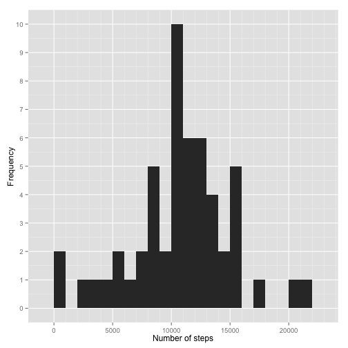
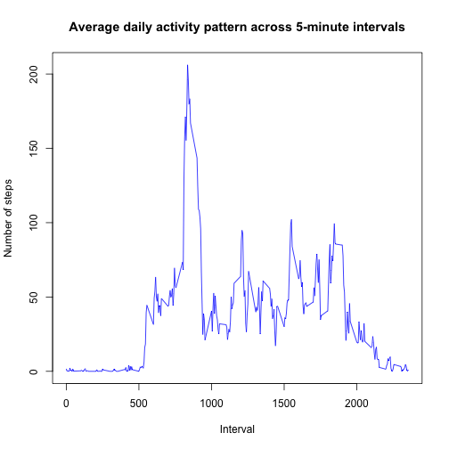
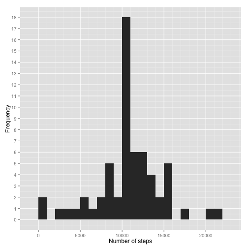
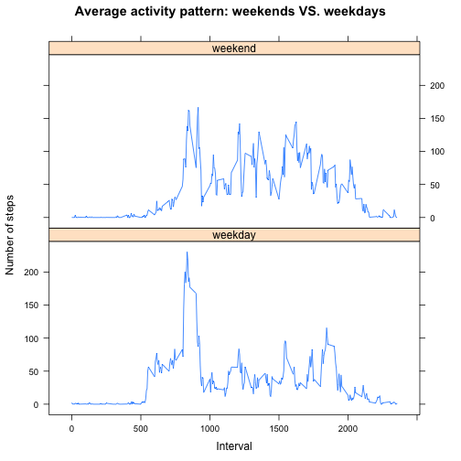

# Reproducible Research: Peer Assessment 1
This report contains the results of an analysis of data from a personal activity monitoring device. The data consists of two months of data from an anonymous individual collected during the months of October and November, 2012 and include the number of steps taken in 5 minute intervals each day. 

## Loading and preprocessing the data
This analysis assumes that the original 'activity.csv' file is in the current working directory. The initial data were obtained here: https://d396qusza40orc.cloudfront.net/repdata%2Fdata%2Factivity.zip (accessed on July 14, 2014 at 11:19 PM CEST).

Loading the data into R and creating a data frame called 'activityData':

```r
activityData <- read.csv("activity.csv", header=TRUE)
```

## What is mean total number of steps taken per day
The histogram below illustrates the distribution of 'total number of steps taken each day' across the sample:

```r
library(ggplot2)
totalSteps <- with(activityData, tapply(steps,date,sum))
qplot(totalSteps, binwidth=1000) + labs(x = "Number of steps", y = "Frequency") + scale_x_continuous(minor_breaks = seq(0, 25000, 1000)) + scale_y_continuous(breaks=seq(0,10,1))
```

 

The **mean** of total steps per day is:

```r
with(activityData, mean(tapply(steps,date,sum),na.rm=TRUE))
```

```
## [1] 10766
```
The **median** of total steps per day is:

```r
with(activityData, median(tapply(steps,date,sum),na.rm=TRUE))
```

```
## [1] 10765
```

## What is the average daily activity pattern?
The following plot illustrates the average activity pattern measured in average number of steps per interval:


```r
dailyPattern <- sapply(split(activityData$steps, activityData$interval), mean, na.rm=T)
plot(names(dailyPattern), dailyPattern, type="l", col="blue", xlab="Interval", ylab="Number of steps", main="Average daily activity pattern across 5-minute intervals")
```

 

Identifying the interval with the **maximum** average number of steps: 

```r
df <- data.frame(Steps=dailyPattern, Interval=names(dailyPattern))
df <- df[order(df$Steps, decreasing=T),]
df[1,]
```

```
##     Steps Interval
## 835 206.2      835
```
The interval '835' has the largest number of steps on average (just over 206). This corresponds to the time interval between 8:35 and 8:40 AM. The pattern suggests a particular daily routine, e.g. a morning workout or commute to work.

## Imputing missing values
Several days have missing values for the 'steps' variable.


```r
dailyNAs <- with(activityData, tapply(steps,date,is.na))
sapply(dailyNAs,sum)
```

```
## 2012-10-01 2012-10-02 2012-10-03 2012-10-04 2012-10-05 2012-10-06 
##        288          0          0          0          0          0 
## 2012-10-07 2012-10-08 2012-10-09 2012-10-10 2012-10-11 2012-10-12 
##          0        288          0          0          0          0 
## 2012-10-13 2012-10-14 2012-10-15 2012-10-16 2012-10-17 2012-10-18 
##          0          0          0          0          0          0 
## 2012-10-19 2012-10-20 2012-10-21 2012-10-22 2012-10-23 2012-10-24 
##          0          0          0          0          0          0 
## 2012-10-25 2012-10-26 2012-10-27 2012-10-28 2012-10-29 2012-10-30 
##          0          0          0          0          0          0 
## 2012-10-31 2012-11-01 2012-11-02 2012-11-03 2012-11-04 2012-11-05 
##          0        288          0          0        288          0 
## 2012-11-06 2012-11-07 2012-11-08 2012-11-09 2012-11-10 2012-11-11 
##          0          0          0        288        288          0 
## 2012-11-12 2012-11-13 2012-11-14 2012-11-15 2012-11-16 2012-11-17 
##          0          0        288          0          0          0 
## 2012-11-18 2012-11-19 2012-11-20 2012-11-21 2012-11-22 2012-11-23 
##          0          0          0          0          0          0 
## 2012-11-24 2012-11-25 2012-11-26 2012-11-27 2012-11-28 2012-11-29 
##          0          0          0          0          0          0 
## 2012-11-30 
##        288
```
The table above shows that there are a total of eight days with no data for 'steps', i.e. all the data points are missing ("NAs"). Further, all the other days are complete, i.e. do not have any missing data.
The total number of rows with missing data is:

```r
sum(is.na(activityData$steps))
```

```
## [1] 2304
```
The following code creates a new data frame called 'activityDataImputed'. It imputes the missing values identified above using the mean value for 'steps' for the corresponding interval for each 'NA'; otherwise it is identical to the 'activityData' set. Using mean interval values was deemed the most suitable procedure in the absence of more detailed information regarding the reasons for the missing data for those eight days.


```r
activityData$meanStepsInt <- rep(dailyPattern,61)
library(plyr)
activityDataImputed <- mutate(activityData,steps=ifelse(is.na(steps),meanStepsInt,steps))
activityDataImputed <- activityDataImputed[,1:3]
```

The distribution of the total number of steps per day and the measures of central tendency after imputing the missing values are as follows:


```r
totalSteps2 <- with(activityDataImputed, tapply(steps,date,sum))
qplot(totalSteps2, binwidth=1000) + labs(x = "Number of steps", y = "Frequency") + scale_x_continuous(minor_breaks = seq(0, 25000, 1000)) + scale_y_continuous(breaks=seq(0,20,1))
```

 

The **mean** of total steps per day with imputed missing values is:

```r
with(activityData, mean(tapply(steps,date,sum),na.rm=TRUE))
```

```
## [1] 10766
```
The **median** of total steps per day with imputed missing values is:

```r
with(activityData, median(tapply(steps,date,sum),na.rm=TRUE))
```

```
## [1] 10765
```

The results for the mean and median are identical to the ones calculated above. This result was to be expected given that the *mean* values of the initial data were used to impute the missing ones, which only reinforces the existing trends and central tendency in the data. As a result, the spike in the plot representing the most frequent interval of the average number of steps per day (10000-11000) is 8 points higher than before, which corresponds to the imputed data for the previously missing eight days.

## Are there differences in activity patterns between weekdays and weekends?
Creating a new factor variable indicating whether the data are from a 'weekday' or a 'weekend':

```r
activityDataImputed$date <- as.POSIXct(activityDataImputed$date)
weekdaysList <- c("Monday","Tuesday","Wednesday","Thursday","Friday")
activityDataImputed$weekday <- factor(ifelse(weekdays(activityDataImputed$date) %in% weekdaysList, "weekday","weekend"))
```
Plotting the average daily pattern for weekdays and weekends, respectively:


```r
weekendData <- activityDataImputed[activityDataImputed$weekday=="weekend",]
weekdayData <- activityDataImputed[activityDataImputed$weekday=="weekday",]

dailyPatternWeekdays <- sapply(split(weekdayData$steps, weekdayData$interval), mean, na.rm=T)
dailyPatternWeekends <- sapply(split(weekendData$steps, weekendData$interval), mean, na.rm=T)
weekdaysSteps <- append(dailyPatternWeekdays,dailyPatternWeekends)
dailyPatternDF <- data.frame("steps"=weekdaysSteps,"interval"=rep(unique(activityDataImputed$interval),2),"weekday"=c(rep("weekday",288),rep("weekend",288)))
library(lattice)
xyplot(steps~interval|weekday,data=dailyPatternDF, type="l", layout=c(1,2), ylab="Number of steps", xlab="Interval", main="Average activity pattern: weekends VS. weekdays")
```

 

The panel plot above shows both similarities and significant differences between the activity patterns on weekdays and weekends. Overall, there appears to be a higher activity level on weekends, especially during the afternoon. Night-time patterns, in contrast, are fairly similar. However, the activity spike around 9 AM is much less pronounced on weekends. On average, the individual appears to rise earlier on weekdays (which might have been expected). Although only a conjecture, the relatively low, constant activity pattern during weekday afternoons might indicate an office-based work life. 
